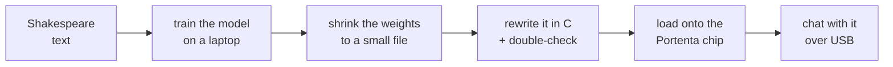

# portenta-slm

**I trained a Small Language Model to write like Shakespeare, then got it running on a little
chip you can hold in your hand — and you can chat with it over USB serial.**

I wanted to see what a small microcontroller could do while also learning how Language models actually train, and infer on text.
This is a really simple way to learn what models are actually doign under the hood. 

Once it's loaded, the chip does all the thinking by itself. You type something and it writes back. Just like any Chatbot:

```
prompt> ROMEO:
ROMEO:
What say the heart of such a sweet to be the world,
And then the gods...
```

The whole point of this project was to build every piece myself and actually
understand it.
Not just call somebody's "make an AI" button. So everything
here is small enough to read and figure out.
I did use claude 4.6 to help me figure some parts of it out though.
Even then it is very simple and easy to understand with the comments in all the code. 

You might be wondering why I chose a Portenta H7... well aside from the fact that it is marketed towards light AI work loads, we also use a lot of STM32 devices at work, so it always helps to be more familiar with how they do things. Also I just had one laying around and I didn't want to build yet another Raspberry Pi thing.

---

## TDLR, here is what we did:

1. **Turn letters into numbers** so a computer can work with them → [`train/tokenizer.py`](train/tokenizer.py)
2. **Build the AI** (a small "guess the next letter" model) → [`train/model.py`](train/model.py)
3. **Teach it** on a big chunk of Shakespeare → [`train/train.py`](train/train.py)
4. **Shrink it** so it's small enough to fit on the chip → [`train/quantize.py`](train/quantize.py) + [`train/export.py`](train/export.py)
5. **Rewrite it in C** and double-check it gives the same answers → [`c_inference/run.c`](c_inference/run.c) + [`train/ref.py`](train/ref.py)
6. **Put it on the chip** and make it fast enough to chat with → [`firmware/`](firmware/)



The big idea: a Language Model is really just **a pile of numbers** plus **a recipe
for multiplying them**. You can train on a fast computer, save the numbers, and
then re-do the multiplying anywhere — even on a chip with no internet and barely
any memory.

---

## How it works (the longer, friendlier version)

### 1. Letters become numbers

A computer can't do math on the letter "h." So we give every character a number.
In our Shakespeare text there are only 65 different characters, so:

```
"Hi"  ->  [20, 47]      (H is number 20, i is number 47)
```

That's the whole tokenizer. From here on, "text" is just a list of numbers.
→ [`train/tokenizer.py`](train/tokenizer.py)

### 2. The model guesses the next letter

That's *all* it does. Give it `"To be or not to b"` and it guesses `"e"`. Do that
over and over and it writes whole sentences.

Inside, the trick that makes it smart is called **attention**: to guess the next
letter, each letter gets to "look back" at the earlier letters and pay more
attention to the ones that matter. (After "Q" it learns to look for where it
should put a "u".) → [`train/model.py`](train/model.py)

### 3. Teaching it

At the start the model is clueless and spits out junk like `xZq!fG`. Teaching is
a loop: it guesses, we tell it the right answer, it nudges itself to be a little
less wrong, and we repeat a few thousand times. You can literally watch it
improve:

```
early on:   xZq!fG kk...
later:      What say the senators of the seal of the seat...
```

We do this part in **[MLX](https://github.com/ml-explore/mlx)**, Apple's tool for
using the Mac's graphics chip — it's fast and the code stays simple.
→ [`train/train.py`](train/train.py)

### 4. Shrinking it to fit

The chip has very little room. The trained model stores each number using 4
bytes, which is too big. But the numbers are all small, so we store each one as
a **single byte** instead (a whole number from -127 to 127, plus one "scale" to
get the real value back). That's 4x smaller, and the writing barely changes.

```
0.2731  (4 bytes)   ->   87  (1 byte)   ->   87 × scale ≈ 0.273
```

→ [`train/quantize.py`](train/quantize.py) saves it to one file → [`train/export.py`](train/export.py)

### 5. Rewriting it in C, and the "answer key"

The chip can't run Python, so the model gets rewritten in plain C — just loops
and multiplication, no fancy libraries. → [`c_inference/run.c`](c_inference/run.c)

How do we know the C version is correct? We keep an **answer key**: a second copy
of the model in simple Python that reads the exact same file. If the C code and
the answer key spit out the same numbers, the C is right. This let us catch every
bug on the laptop *before* touching the chip (way easier to fix there).
→ [`train/ref.py`](train/ref.py)

```
answer key (Python):  12.05  9.70  0.91  -4.51  -3.12
our C code:           12.05  9.70  0.91  -4.51  -3.12   ✓ match
```

### 6. On the chip — and a speed trick

The same C code goes onto the Portenta, where the model lives in the chip's
memory. → [`firmware/src/slm.c`](firmware/src/slm.c) and the chat program
[`firmware/src/main.cpp`](firmware/src/main.cpp)

The first version worked but was **slow** (about half a character per second).
The problem: to write each new letter, it was re-reading *every* earlier letter
from scratch. So we added a **memory** (called a KV cache): once it's looked at a
letter, it remembers it instead of redoing the work.

```
before:  for each new letter, re-read ALL previous letters   (slow)
after:   remember the old letters, only handle the new one    (~15x faster)
```

This is the same trick the big chatbots use. → it's the `kcache`/`vcache` part of
[`firmware/src/slm.c`](firmware/src/slm.c)

---

## What you need

- A **Mac with Apple Silicon** (M1/M2/etc.) to train — the training tool only
  runs there.
- An **Arduino Portenta H7** board and a **USB-C cable** for the chip part.
- A couple of free tools: `brew install dfu-util` (to load the chip) and
  PlatformIO (to build the chip program).

> One gotcha: the training tool needs a real Apple-Silicon (arm64) Python. The
> default Anaconda Python often runs in a compatibility mode that won't work —
> the steps below make a clean one.

---

## Run it yourself

```bash
# one-time setup: a Python just for training
python3 -m venv .venv          # use an arm64 python3, e.g. /usr/bin/python3
.venv/bin/pip install mlx numpy

# and a separate one for the chip tools
python3 -m venv .piovenv
.piovenv/bin/pip install platformio
```

**Train it** (about 6 minutes), then save it to a file:

```bash
PYTHONPATH=train .venv/bin/python train/train.py 5000
PYTHONPATH=train .venv/bin/python train/export.py
```

**Try it on your computer first** (and confirm it matches the answer key):

```bash
.venv/bin/python train/ref.py "First Citizen:"        # the answer key
cd c_inference && cc run.c -o run -lm -O2 && ./run     # the C version
```

**Put it on the Portenta:**

```bash
.venv/bin/python train/embed_model.py                 # bakes the model into the chip program

cd firmware
# double-tap the board's reset button (the green light starts pulsing), then:
../.piovenv/bin/pio run -t upload
```

**Chat with it.** Open the serial connection and type:

```bash
cd firmware
../.piovenv/bin/pio device monitor -b 115200          # quit with Ctrl-C
```

Type a prompt, press Enter, and it writes back.

---

## Where the ideas came from

- **Andrej Karpathy** — the model is a tiny version of his
  [nanoGPT](https://github.com/karpathy/nanoGPT), and the "rewrite the AI in
  plain C" idea comes from his [llama2.c](https://github.com/karpathy/llama2.c).
- **tinyshakespeare** — the classic little file of Shakespeare's plays that lots
  of these projects learn from ([`data/tinyshakespeare.txt`](data/tinyshakespeare.txt)).
- **Apple MLX** — what we train with so it runs fast on the Mac.

---

## Honest notes

This is a *tiny* model (about half a million numbers) running on a chip, not
ChatGPT. It only remembers about 96 characters at a time, so replies are a
sentence or two, and they sound Shakespeare-ish without really making sense. But
every single number in it came from this repo — and it all runs on a chip with no
internet. That was the fun part.

## License

MIT — do whatever you like with it.
